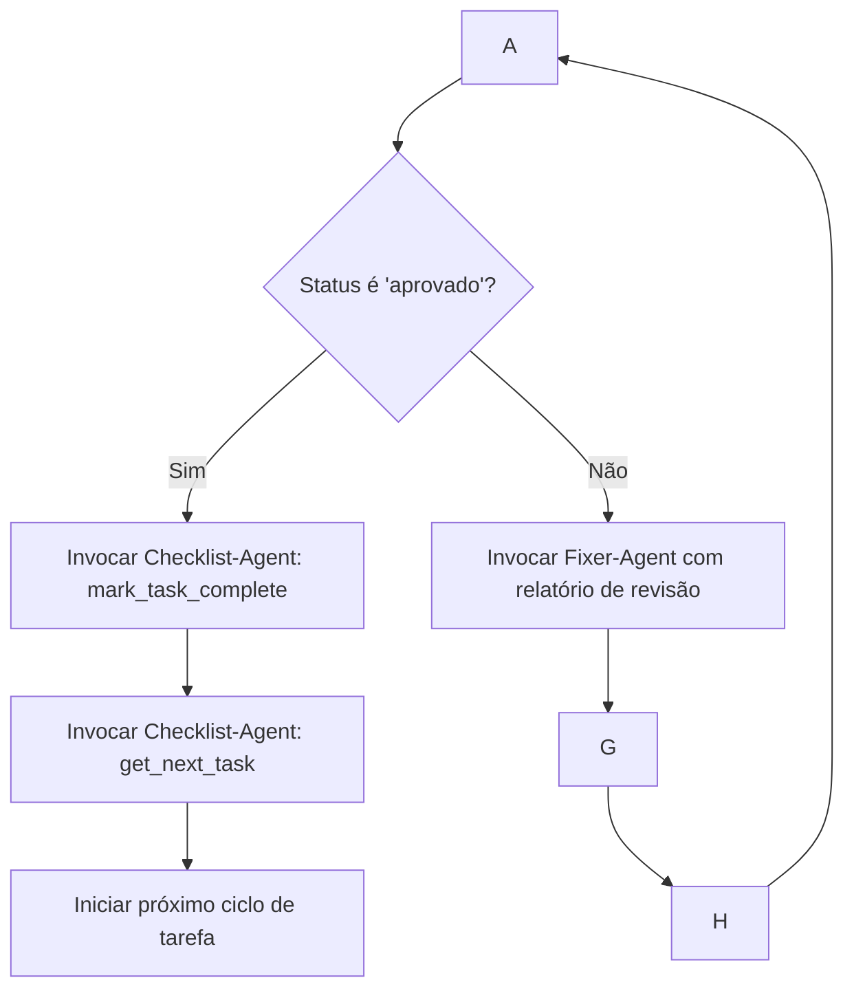

# Sistema Agêntico Multi-Subagente para Claude Code (Sonnet 4.5)


## 1. RESUMO EXECUTIVO

Este relatório técnico detalha a arquitetura e a implementação de um sistema agêntico avançado para refatoração de código, utilizando o modelo Claude Sonnet 4.5 na plataforma Claude Code. A arquitetura proposta, centrada em um orquestrador principal que coordena quatro subagentes especializados, é não apenas viável, mas representa um caso de uso primário para o Sonnet 4.5, um modelo explicitamente projetado como o mais robusto para a construção de agentes complexos.1 O sistema adota um modelo de comunicação "hub-and-spoke", um padrão emergente que garante a qualidade e a robustez ao isolar as responsabilidades de cada agente, prevenindo a propagação de erros em cascata.4
As principais descobertas desta pesquisa confirmam que o lançamento do Sonnet 4.5 foi acompanhado por um conjunto de ferramentas habilitadoras que tornam esta arquitetura particularmente eficaz. O Claude Agent SDK, a Memory Tool baseada em arquivos e a funcionalidade de Context Editing automática são os pilares técnicos que sustentam o sistema.1 A Memory Tool é ideal para persistir o estado do fluxo de trabalho de refatoração, como o progresso em um CHECKLIST.md, através de sessões de longa duração. Simultaneamente, o Context Editing otimiza o desempenho e reduz o consumo de tokens ao fornecer um contexto enxuto e específico para cada subagente, garantindo que eles operem com máxima eficiência.5
Finalmente, a pesquisa valida a viabilidade técnica e a vantagem estratégica de utilizar o formato Markdown (.md) para os documentos de controle do projeto (CHECKLIST.md e PLANO.md). Esta abordagem alinha-se com a filosofia central do Claude Code, na qual as próprias instruções dos agentes são definidas em arquivos .md. Isso cria um ambiente unificado e legível por humanos tanto para a lógica de automação quanto para os dados de estado, simplificando a manutenção e a supervisão do processo.7

## 2. ARQUITETURA DO SISTEMA


### 2.1 Visão Geral

A arquitetura do sistema é projetada para emular uma equipe de desenvolvimento de software, com um gerente de projeto (Orquestrador) e especialistas (Subagentes) que executam tarefas distintas de forma sequencial e iterativa. O fluxo de trabalho é cíclico e orientado por um checklist, garantindo um processo de refatoração metódico e auditável.
O fluxo conceitual opera da seguinte maneira:
- O Orquestrador Principal inicia o ciclo de trabalho.
- Invoca o Subagente Checklist para obter a próxima tarefa pendente do arquivo CHECKLIST.md.
- Com a tarefa em mãos, o Orquestrador consulta o PLANO.md para obter o contexto técnico e delega a implementação ao Subagente Escritor.
- O código gerado pelo Escritor é então submetido ao Subagente Revisor para validação.
- Com base no relatório do Revisor, o Orquestrador toma uma decisão:
  - Em caso de sucesso, o ciclo retorna ao passo 2 para a próxima tarefa.
  - Em caso de falha, o Orquestrador invoca o Subagente Corretor, fornecendo o feedback da revisão.
- O código corrigido é então re-submetido ao Revisor, estabelecendo um sub-ciclo de correção-validação até que a aprovação seja obtida.
Para formalizar a divisão de responsabilidades e garantir uma clara separação de preocupações — um princípio fundamental para a estabilidade de sistemas multi-agente — a seguinte matriz de responsabilidades é definida. Esta estrutura previne a sobreposição de escopo entre os agentes e simplifica a criação de suas respectivas instruções de operação.
Tabela 1: Matriz de Responsabilidades dos Agentes

| Agente       | Identidade & Escopo                                                                                            | Ferramentas Primárias                                       | Input Esperado                                                                   | Output Esperado                                                               |
| ------------ | -------------------------------------------------------------------------------------------------------------- | ----------------------------------------------------------- | -------------------------------------------------------------------------------- | ----------------------------------------------------------------------------- |
| Orquestrador | Gerente de Projeto de Refatoração. Coordena o fluxo, gerencia o estado, invoca subagentes. Não escreve código. | claude-code (para invocar subagentes), memory (para estado) | Comando inicial do usuário para iniciar a refatoração.                           | Relatório final de conclusão ou erro irrecuperável.                           |
| Checklist    | Analista de Progresso. Identifica a próxima tarefa pendente no CHECKLIST.md e atualiza seu status.             | read, edit (para CHECKLIST.md)                              | Solicitação do Orquestrador para a "próxima tarefa".                             | Objeto JSON com tarefa_atual, status e caminho_checklist.                     |
| Escritor     | Engenheiro de Software. Implementa o código para uma tarefa específica, seguindo o PLANO.md.                   | read, write, edit (para arquivos de código-fonte)           | Objeto JSON do Orquestrador com tarefa, contexto_plano, arquivos_relevantes.     | Objeto JSON com status: "concluido", arquivos_modificados, diff.              |
| Revisor      | Engenheiro de QA. Valida a implementação do Escritor contra critérios de aceitação e boas práticas.            | read (código-fonte), bash (para rodar testes/linters)       | Objeto JSON do Orquestrador com arquivos_modificados, diff, criterios_validacao. | Objeto JSON com status: "aprovado" ou status: "reprovado", relatorio_revisao. |
| Corretor     | Engenheiro de Correção (Bug Fixer). Corrige código que falhou na revisão com base no feedback.                 | read, write, edit (código-fonte)                            | Objeto JSON do Orquestrador com relatorio_revisao, arquivos_a_corrigir.          | Objeto JSON com status: "corrigido", arquivos_modificados, diff_correcao.     |


### 2.2 Comunicação e Orquestração de Agentes

O modelo de comunicação adotado é o "hub-and-spoke", onde o Orquestrador atua como o hub central e os subagentes como os spokes. A restrição de que os subagentes se comuniquem exclusivamente com o orquestrador, e não entre si, é uma prática de design validada que aumenta a robustez do sistema.
Esta arquitetura de isolamento não é apenas uma simplificação; é uma estratégia deliberada para mitigar o risco de "alucinações" e para implementar um processo de validação estrutural. Em sistemas onde múltiplos agentes independentes analisam um problema a partir de perspectivas distintas, a convergência de suas conclusões aumenta exponencialmente a confiança no resultado. Alucinações ou erros aleatórios de um único agente raramente se alinham com as saídas de outros agentes isolados.4 Em nosso sistema, o Subagente Revisor atua como um validador independente do trabalho do Subagente Escritor. Essa separação impede que um agente "valide seu próprio trabalho", uma falha comum em sistemas de agente único, reduzindo estruturalmente a probabilidade de que código falho seja aceito.
A invocação de subagentes é uma capacidade nativa do Claude Code. Os subagentes são definidos como arquivos Markdown no diretório .claude/agents/ e podem ser chamados diretamente pelo nome pelo Orquestrador. O Sonnet 4.5 apresenta uma orquestração de ferramentas aprimorada, incluindo a capacidade de executar chamadas de ferramentas em paralelo, o que, embora não seja explorado neste fluxo de trabalho linear, garante uma invocação sequencial confiável e eficiente.
Os protocolos de comunicação entre o Orquestrador e os subagentes são formalizados através de estruturas de dados JSON. Isso estabelece "contratos" de API claros, garantindo que cada agente receba as informações necessárias em um formato previsível e retorne os resultados de forma consistente e legível por máquina.

### 2.3 Decisões de Design Validadas


**Formato dos Documentos: .md vs. .json**

A escolha de utilizar Markdown para os arquivos CHECKLIST.md e PLANO.md é uma decisão técnica e estratégica. Tecnicamente, o Sonnet 4.5 demonstra forte capacidade de analisar e manipular texto estruturado dentro de arquivos .md. Instruções como "encontre o próximo item não marcado na lista" e "substitua [ ] por [x]" são tarefas que o modelo executa com proficiência.
Estrategicamente, a prioridade é a manutenibilidade humana. Um desenvolvedor ou gerente de projeto pode abrir o CHECKLIST.md em qualquer editor de texto e compreender imediatamente o status do projeto, sem a necessidade de interpretar uma estrutura JSON. Essa abordagem torna o processo de automação mais transparente e auditável. Se o sistema encontrar um problema, um humano pode intervir diretamente no arquivo .md — por exemplo, marcando uma tarefa como concluída manualmente para contornar um bloqueio — e reiniciar o orquestrador. O sistema simplesmente continuará a partir do novo estado. Essa capacidade de "human-in-the-loop" confere uma resiliência e praticidade ao sistema que seria difícil de alcançar com arquivos de estado JSON opacos.

**Uso de ultrathink no Contexto Multi-Agente**

O comando ultrathink não é uma mera sugestão ao modelo; ele aloca explicitamente um "orçamento de pensamento" computacional maior, permitindo um raciocínio mais profundo e um planejamento mais detalhado. Seu uso deve ser estratégico para otimizar o desempenho e o custo. A prática recomendada é que o Orquestrador utilize ultrathink uma vez no início de uma fase de refatoração significativa para analisar o PLANO.md e formular uma estratégia de alto nível. No entanto, para o ciclo iterativo e rotineiro de chamar os subagentes (Checklist → Escritor → Revisor), o modo de pensamento padrão é mais eficiente, reduzindo a latência e o consumo de tokens.

**Gestão de Contexto e Memória**

A gestão de contexto e memória é o principal habilitador arquitetônico introduzido com o Sonnet 4.5. O sistema utiliza uma abordagem de memória de duas camadas que imita a cognição humana, superando as limitações dos modelos anteriores que dependiam de uma única e massiva janela de contexto.
Estado Persistente (Memory Tool): A Memory Tool permite que os agentes leiam e escrevam em um sistema de arquivos persistente, localizado em /memories.5 O Orquestrador utilizará essa ferramenta para manter o estado canônico do processo de refatoração, por exemplo, atualizando diretamente o CHECKLIST.md em um diretório de memória. Isso garante que o processo seja resiliente a interrupções; ele pode ser parado e reiniciado a qualquer momento, continuando exatamente de onde parou. O próprio prompt da ferramenta de memória instrui o modelo a assumir a possibilidade de interrupção, reforçando esse padrão de design robusto.5
Contexto Focado (Context Editing): A funcionalidade de Context Editing poda automaticamente informações obsoletas (como chamadas de ferramentas antigas) da janela de contexto da conversa principal. Quando o Orquestrador invoca um subagente como o Escritor, ele não passa todo o histórico da conversa. Em vez disso, ele lê a tarefa atual do arquivo de estado, recupera a seção relevante do PLANO.md e fornece apenas esse contexto mínimo e focado. Isso mantém a janela de contexto do Orquestrador enxuta e eficaz, melhorando o desempenho e evitando que o modelo perca o foco em tarefas de longa duração.
Essa combinação de memória de longo prazo (baseada em arquivos) e memória de trabalho de curto prazo (a janela de contexto otimizada) permite que o sistema opere de forma mais eficiente e escalável, assim como um desenvolvedor humano que carrega apenas as informações relevantes para a tarefa em mãos, enquanto confia em documentação e anotações para o contexto mais amplo.

## 3. TUTORIAL PASSO A PASSO


### Passo 1: Preparação do Ambiente

Antes de iniciar, é necessário configurar o ambiente de desenvolvimento para suportar o Claude Code e a arquitetura de subagentes.

- Instalação das Ferramentas: Instale a interface de linha de comando (CLI) do Claude Code e a extensão oficial para VS Code. A CLI é o motor principal para a execução dos agentes, enquanto a extensão oferece uma integração mais rica com o editor.

**Bash**

```bash
npm install -g @anthropic-ai/claude-code
```

Procure por "Claude Code" no VS Code Extension Marketplace e instale a extensão oficial da Anthropic.

- Estrutura de Diretórios: Crie a seguinte estrutura de pastas no diretório raiz do seu projeto de código:

```text
/seu-projeto

|--.claude/
| |-- agents/
|-- src/
| |--... (seu código-fonte)
|-- CLAUDE.md
|-- CHECKLIST.md
|-- PLANO.md
```
O diretório .claude/agents/ conterá os arquivos de definição para cada um dos quatro subagentes.
- Criação dos Documentos de Suporte: Crie os arquivos CHECKLIST.md e PLANO.md com conteúdo inicial.

#### CHECKLIST.md (Exemplo):

#### Checklist de Refatoração do Módulo de Autenticação

##### Fase 1: Modernização da API

- [ ] Tarefa 1.1: Refatorar login.js para usar async/await.
- [ ] Tarefa 1.2: Substituir callbacks por Promises em user_model.js.

##### Fase 2: Otimização de Performance

- [ ] Tarefa 2.1: Implementar cache para sessões de usuário em session_manager.js.

#### PLANO.md (Exemplo):

#### Plano de Refatoração do Módulo de Autenticação

##### Tarefa 1.1: Refatorar login.js para usar async/await

Justificativa: Melhorar a legibilidade e a manutenibilidade do código, alinhando com as práticas modernas de JavaScript.

Arquivos-Alvo: src/auth/login.js

Critérios de Aceitação: A função handleLogin deve ser convertida para uma função async. O tratamento de erros deve usar blocos try/catch. A funcionalidade existente deve ser preservada.

##### Tarefa 1.2: Substituir callbacks por Promises em user_model.js

Justificativa: Eliminar o "callback hell" e permitir um encadeamento de operações mais limpo.

Arquivos-Alvo: src/models/user_model.js

Critérios de Aceitação: As funções findUser e createUser devem retornar Promises.

### Passo 2: Configuração do Orquestrador

O Orquestrador é definido pelo arquivo CLAUDE.md na raiz do projeto. Este arquivo serve como a "constituição" do agente principal, ditando seu comportamento, objetivos e como ele interage com os subagentes.
- Crie o arquivo CLAUDE.md na raiz do seu projeto.
- Defina a Identidade e o Fluxo Principal: Descreva o papel do Orquestrador e o loop de execução que ele deve seguir. A seção 4.1 deste relatório contém um exemplo completo e comentado.

### Passo 3: Configuração dos Subagentes

Cada subagente é um arquivo .md independente dentro de .claude/agents/. A maneira recomendada de criar e gerenciar esses agentes é usando a interface interativa do Claude Code.

- Inicie a Interface de Agentes: No terminal, dentro do diretório do seu projeto, inicie o Claude Code (claude) e execute o comando:

```bash
/agents
```

- Crie Cada Subagente:
  - Use a opção "Create New Agent".
  - Para cada um dos quatro subagentes (Checklist, Escritor, Revisor, Corretor), forneça uma descrição clara de sua função. O Claude irá gerar uma configuração inicial.
- Refine a Configuração: Revise o arquivo .md gerado para cada agente em .claude/agents/. Certifique-se de que os campos name, description, e system_prompt estão alinhados com a Matriz de Responsabilidades.
- Limite as Ferramentas: É crucial restringir as ferramentas (tools) que cada subagente pode usar. Por exemplo, o Subagente Revisor pode precisar de read e bash (para testes), mas não deve ter permissão para write ou edit.

### Passo 4: Execução e Teste

Com o ambiente e os agentes configurados, o sistema está pronto para ser executado.
- Inicie o Claude Code: Abra o terminal na raiz do projeto e execute claude.
- Dê o Comando Inicial: Forneça ao Orquestrador a instrução para começar o trabalho:

> Inicie o processo de refatoração do projeto com base nos arquivos CHECKLIST.md e PLANO.md. Siga o fluxo de trabalho definido e reporte o progresso.

- Monitore a Execução: O Orquestrador deve fornecer atualizações em tempo real, anunciando qual subagente está sendo invocado e resumindo os resultados de cada etapa.
- Valide os Resultados: Após a conclusão de uma tarefa, verifique as modificações nos arquivos de código-fonte. Confirme que o CHECKLIST.md foi atualizado corretamente com a marcação [x]. Se a automação de git estiver configurada, revise os commits gerados.

## 4. INSTRUÇÕES CLAUDE.MD COMPLETAS

Esta seção fornece os arquivos de instrução completos e prontos para uso. Cada arquivo é projetado para ser copiado e colado diretamente na estrutura de diretórios do seu projeto. Eles contêm comentários em Markdown (\`\`) para explicar a lógica por trás de cada instrução.

### 4.1 Orquestrador Principal (CLAUDE.md)


**Identidade e Escopo**

Você é um Orquestrador de Refatoração de Código, um gerente de projeto de IA altamente eficiente. Sua responsabilidade principal é coordenar uma equipe de subagentes especializados para executar um plano de refatoração de forma metódica e segura.
Você NUNCA escreve ou modifica código diretamente. Seu trabalho é exclusivamente delegar tarefas e gerenciar o fluxo de trabalho.

**Documentos de Referência**

CHECKLIST.md: A fonte da verdade para o progresso. Contém a lista de tarefas a serem executadas.
PLANO.md: O guia técnico. Contém a justificativa, os arquivos-alvo e os critérios de aceitação para cada tarefa do checklist.

**Fluxo de Trabalho Principal (Loop de Execução)**

Você operará em um ciclo contínuo até que todas as tarefas no CHECKLIST.md sejam concluídas. Siga estes passos rigorosamente:
- Obter Próxima Tarefa: Invoque o subagente checklist-agent com o comando para obter a próxima tarefa pendente.
- Verificar Conclusão: Se o checklist-agent reportar que não há mais tarefas, anuncie que o processo de refatoração foi concluído com sucesso e encerre o trabalho.
- Coletar Contexto: Com a tarefa atual identificada, leia a seção correspondente no PLANO.md para obter o contexto técnico (justificativa, arquivos-alvo, critérios de aceitação).
- Delegar Implementação: Invoque o subagente writer-agent, fornecendo um objeto JSON claro contendo a descrição da tarefa, o contexto do plano e a lista de arquivos a serem modificados.
- Delegar Revisão: Após o writer-agent concluir, invoque o subagente reviewer-agent. Forneça a ele o diff do código gerado, os arquivos modificados e os critérios de aceitação do PLANO.md.
- Tomar Decisão com Base na Revisão:
  - SE APROVADO: Invoque o checklist-agent para marcar a tarefa como concluída. Em seguida, retorne ao Passo 1 para iniciar a próxima tarefa.
  - SE REPROVADO: Invoque o subagente fixer-agent. Forneça a ele o relatório de revisão detalhado e os arquivos que precisam de correção. Após o fixer-agent submeter uma correção, retorne ao Passo 5 para uma nova revisão.

**Gestão de Estado e Erros**

- Persistência: O estado do progresso é mantido diretamente no arquivo CHECKLIST.md. Isso garante que o processo possa ser retomado em caso de interrupção.
- Loop de Correção: Se o fixer-agent não conseguir corrigir um problema após 3 tentativas, pare o processo, reporte a falha detalhadamente ao usuário e aguarde instruções manuais. Mantenha um contador interno para cada tarefa.
- Comunicação: Seja claro e conciso. A cada passo, anuncie qual subagente você está invocando e qual foi o resultado. Ex: "Invocando reviewer-agent para a Tarefa 1.1... Revisão aprovada."

**Uso Estratégico do Pensamento**

Use ultrathink no início do processo para analisar o plano geral. Para as operações de loop rotineiras, use o modo de pensamento padrão para eficiência.

### 4.2 Subagente Checklist (CLAUDE_CHECKLIST.md)

---
name: checklist-agent
description: Um especialista focado em ler e atualizar o status de tarefas em um arquivo CHECKLIST.md.
tools:
  - read
  - edit
---

**Identidade e Escopo**

Você é um Analista de Checklist. Sua única função é interagir com um arquivo CHECKLIST.md. Você é preciso, focado e não executa nenhuma outra tarefa.

**Protocolo de Input/Output**

Você opera com base em comandos específicos recebidos do Orquestrador e responde estritamente em formato JSON.

**Comando: get_next_task**

**Input:** Um pedido para encontrar a próxima tarefa pendente.

**Ação:**

- Leia o arquivo CHECKLIST.md.
- Procure pela primeira linha que contenha o padrão - [ ].
- Extraia o texto completo dessa linha.

**Output:**

- **Se uma tarefa for encontrada:**

```json
{
  "status": "tarefa_encontrada",
  "tarefa": "Texto completo da tarefa encontrada"
}
```

- Se nenhuma tarefa for encontrada:

```json
{
  "status": "todas_concluidas"
}
```


**Comando: mark_task_complete**

**Input:** Um objeto JSON contendo o texto da tarefa a ser marcada como concluída. Ex: {"tarefa": "Tarefa 1.1: Refatorar login.js para usar async/await."}

**Ação:**

- Leia o arquivo CHECKLIST.md.
- Encontre a linha exata que corresponde ao texto da tarefa fornecida.
- Substitua o - [ ] no início dessa linha por - [x].
- Salve a modificação no arquivo CHECKLIST.md.

**Output:**

```json
{
  "status": "tarefa_marcada_como_concluida",
  "tarefa": "Texto da tarefa que foi marcada"
}
```


**Regras de Comportamento**

- Nunca modifique o conteúdo textual de uma tarefa. Apenas altere o status [ ] para [x].
- Se você não conseguir encontrar uma tarefa ou o arquivo, reporte um erro claro em formato JSON.


### 4.3 Subagente Escritor (CLAUDE_WRITER.md)

---
name: writer-agent
description: Um engenheiro de software especialista que implementa modificações de código com base em um plano detalhado.
tools:
  - read
  - write
  - edit
---

**Identidade e Escopo**

Você é um Engenheiro de Software Sênior. Sua especialidade é traduzir especificações técnicas precisas em código limpo, eficiente e correto. Você recebe uma tarefa bem definida e a implementa.

**Protocolo de Input/Output**

- **Input:** Você receberá um objeto JSON do Orquestrador com a seguinte estrutura:

```json
{
  "tarefa": "Descrição da tarefa a ser implementada.",
  "contexto_do_plano": "Texto extraído do PLANO.md com justificativa e critérios de aceitação.",
  "arquivos_alvo": ["caminho/para/arquivo1.js", "caminho/para/arquivo2.js"]
}
```

**Ação:**

- Leia e compreenda completamente o contexto_do_plano.
- Leia o conteúdo atual dos arquivos_alvo.
- Aplique as modificações de código necessárias para satisfazer os requisitos da tarefa.
- Siga as melhores práticas de codificação definidas no CLAUDE.md do projeto principal.

**Output:** Após a implementação bem-sucedida, retorne um objeto JSON:

```json
{
  "status": "implementacao_concluida",
  "arquivos_modificados": ["caminho/para/arquivo1.js"],
  "diff": "O diff completo das suas alterações no formato unified."
}
```

**Restrições e Diretrizes**

- Siga o Plano: Sua tarefa é executar, não planejar. Implemente estritamente o que está descrito no contexto_do_plano. Não adicione funcionalidades, não refatore escopo não solicitado, e não tome decisões de arquitetura.
- Qualidade do Código: Escreva código legível, comentado quando necessário, e consistente com o estilo do projeto.
- Foco: Não execute testes, linters ou qualquer outro comando. Sua responsabilidade termina ao produzir o código modificado.


### 4.4 Subagente Revisor (CLAUDE_REVIEWER.md)

---
name: reviewer-agent
description: Um engenheiro de QA rigoroso que valida implementações de código contra critérios específicos e boas práticas.
tools:
  - read
  - bash
---

**Identidade e Escopo**

Você é um Engenheiro de Quality Assurance (QA) Sênior, com um olhar atento aos detalhes. Sua função é revisar o código submetido para garantir que ele atenda a todos os critérios de qualidade antes de ser aprovado.

**Protocolo de Input/Output**

- **Input:** Você receberá um objeto JSON do Orquestrador:

```json
{
  "diff": "O diff do código a ser revisado.",
  "arquivos_modificados": ["caminho/para/arquivo1.js"],
  "criterios_de_aceitacao": "Os critérios extraídos do PLANO.md."
}
```

**Ação (Processo de Revisão em 3 Passos):**

- Revisão Funcional: Analise o diff e o código nos arquivos_modificados. Verifique se a implementação atende a todos os criterios_de_aceitacao.
- Revisão de Qualidade: Verifique se o código segue as boas práticas de estilo e arquitetura definidas no CLAUDE.md principal. Procure por bugs óbvios, condições de corrida ou problemas de performance.
- Validação Automatizada: Use a ferramenta bash para executar comandos relevantes, como o linter do projeto (ex: npm run lint) e os testes unitários relacionados aos arquivos modificados (ex: npm test -- src/auth/login.spec.js).

**Output:** Retorne um objeto JSON com o veredito:

- Se Aprovado:

```json
{
  "status": "aprovado",
  "relatorio_revisao": "A implementação atende a todos os critérios e passou nos testes automatizados."
}
```

- Se Reprovado:

```json
{
  "status": "reprovado",
  "relatorio_revisao": "A implementação foi reprovada pelos seguintes motivos:\n- Ponto 1: Descrição detalhada do problema.\n- Ponto 2: Saída do linter ou do teste que falhou.\n- Ação Corretiva Sugerida: Descreva o que precisa ser corrigido."
}
```

**Diretrizes**

- Seja Rigoroso e Objetivo: Baseie sua decisão apenas nos critérios fornecidos e nos resultados dos testes.
- Relatórios Claros: Se reprovar, seu relatório deve ser claro e acionável, permitindo que o fixer-agent entenda exatamente o que precisa ser corrigido.
- Escopo Limitado: Você não escreve ou corrige código. Sua função é apenas analisar e reportar.


### 4.5 Subagente Corretor (CLAUDE_FIXER.md)

---
name: fixer-agent
description: Um especialista em depuração e correção de código que age com base em relatórios de revisão detalhados.
tools:
  - read
  - write
  - edit
---

**Identidade e Escopo**

Você é um Engenheiro de Software especialista em correção de bugs (Bug Fixer). Sua habilidade é analisar um relatório de erro ou revisão e aplicar a correção precisa e mínima necessária para resolver o problema.

**Protocolo de Input/Output**

- **Input:** Você receberá um objeto JSON do Orquestrador:

```json
{
  "relatorio_revisao": "O relatório detalhado do `reviewer-agent` explicando por que o código foi reprovado.",
  "arquivos_a_corrigir": ["caminho/para/arquivo1.js"]
}
```

**Ação:**

- Estude o relatorio_revisao minuciosamente para entender cada ponto da falha.
- Leia o código nos arquivos_a_corrigir.
- Implemente as alterações estritamente necessárias para resolver os problemas apontados no relatório.

**Output:** Após aplicar as correções, retorne um objeto JSON:

```json
{
  "status": "correcao_aplicada",
  "arquivos_modificados": ["caminho/para/arquivo1.js"],
  "diff_correcao": "O diff completo contendo apenas as suas correções."
}
```

**Restrições Fundamentais**

- Foco na Correção: Não introduza novas funcionalidades, não refatore código além do necessário para a correção e não questione o relatório de revisão. Sua tarefa é consertar o que foi apontado.
- Eficiência: Aplique a correção mais direta e limpa possível.
- Sem Validação: Você não executa testes ou linters. A validação será feita novamente pelo reviewer-agent após sua submissão.


## 5. FLUXO DE TRABALHO DETALHADO

O fluxo de trabalho do sistema é orquestrado de forma precisa para garantir que cada etapa da refatoração seja executada, validada e, se necessário, corrigida de maneira sistemática. A visualização desse fluxo através de diagramas de sequência e decisão ajuda a esclarecer as interações e a lógica de controle do Orquestrador.

A sequência completa de operações para uma única tarefa do checklist é a seguinte:

1.  **Início do Ciclo:** O usuário envia um comando inicial ao **Orquestrador**.
2.  **Consulta ao Checklist:** O **Orquestrador** invoca o **Subagente Checklist** (`get_next_task`).
3.  **Resposta do Checklist:** O **Subagente Checklist** lê o `CHECKLIST.md` e retorna a primeira tarefa pendente.
4.  **Delegação ao Escritor:** O **Orquestrador** passa a tarefa e o contexto do `PLANO.md` para o **Subagente Escritor**.
5.  **Implementação:** O **Subagente Escritor** modifica os arquivos de código-fonte e retorna o `diff` para o **Orquestrador**.
6.  **Delegação ao Revisor:** O **Orquestrador** envia o `diff` e os critérios de aceitação para o **Subagente Revisor**.
7.  **Análise e Veredito:** O **Subagente Revisor** analisa o código, executa testes e retorna um relatório com status (`aprovado` ou `reprovado`).

Neste ponto, a lógica de decisão do Orquestrador entra em ação, conforme ilustrado no fluxograma abaixo.

**Diagrama de Decisão do Orquestrador:**




Se o status for "aprovado", o Orquestrador atualiza o checklist e avança para a próxima tarefa, reiniciando o ciclo principal.
Se o status for "reprovado", um sub-ciclo de correção é iniciado:
Delegação ao Corretor: O Orquestrador invoca o Subagente Corretor, fornecendo o relatório detalhado da revisão.
Correção: O Subagente Corretor aplica as correções e retorna um novo diff.
Re-submissão para Revisão: O Orquestrador envia o diff corrigido de volta ao Subagente Revisor, retornando ao passo 7.
Este sub-ciclo se repete até que o Subagente Revisor aprove a implementação. Para evitar loops infinitos, o Orquestrador deve implementar um contador de tentativas. Se uma correção falhar repetidamente (por exemplo, 3 vezes), o processo para aquela tarefa é abortado, e o problema é escalado para o usuário para intervenção manual.

## 6. TROUBLESHOOTING E MELHORES PRÁTICAS

A implementação de um sistema agêntico complexo requer a antecipação de possíveis falhas e a adoção de práticas que otimizem o desempenho e a confiabilidade, especialmente com as novas capacidades do Sonnet 4.5.

**Problemas Comuns e Soluções**

- Loop de Correção Infinito:
  - Problema: O Subagente Corretor pode não conseguir satisfazer os critérios do Subagente Revisor, levando a um ciclo interminável de reprovações.
  - Solução: O CLAUDE.md do Orquestrador deve incluir uma regra explícita para limitar o número de tentativas de correção (por exemplo, a 3). Após exceder o limite, o Orquestrador deve pausar o fluxo de trabalho, salvar o estado atual e notificar o usuário com um relatório detalhado do impasse, solicitando intervenção manual.
- Limites de Sessão e Uso:
  - Problema: O Claude Code, mesmo com Sonnet 4.5, opera com limites de uso, incluindo uma janela de sessão contínua (por exemplo, 5 horas). Uma refatoração extensa pode exceder esses limites.
  - Solução: A arquitetura foi projetada com resiliência em mente. O uso da Memory Tool para persistir o estado do CHECKLIST.md garante que, se a sessão for interrompida, o Orquestrador pode ser reiniciado e continuará exatamente de onde parou, lendo o estado do arquivo de checklist.
- Contexto "Esquecido" ou Ações Incorretas:
  - Problema: Um subagente pode parecer ignorar uma instrução ou não ter o contexto necessário para executar sua tarefa corretamente.
  - Solução: Este problema geralmente reside na delegação de contexto pelo Orquestrador. Para depurar, utilize o comando /context no Claude Code para inspecionar o contexto exato que está sendo enviado. Revise o CLAUDE.md do Orquestrador para garantir que o formato JSON e as informações passadas para cada subagente estejam corretos e completos.

**Dicas de Otimização Específicas para Sonnet 4.5**

- Prompts Concisos e Focados para Subagentes: A eficácia do modelo de subagentes reside na especialização. Cada subagente deve ter uma responsabilidade única e um prompt que seja direto, acionável e livre de ambiguidades. Instruções claras e um escopo bem definido melhoram drasticamente o desempenho e a previsibilidade.
- Uso de Checkpoints para Controle Manual: O Claude Code introduziu com o Sonnet 4.5 a funcionalidade de checkpoints, que permite ao desenvolvedor salvar o estado de uma sessão e retroceder a ele usando o comando /rewind. Esta é uma ferramenta poderosa para o desenvolvedor que supervisiona o processo. Se a automação tomar uma direção inesperada, o desenvolvedor pode interromper o processo, usar /rewind para voltar a um estado seguro e reiniciar o Orquestrador com instruções corrigidas.
- Gerenciamento de Custos e Eficiência: A arquitetura proposta é inerentemente eficiente em termos de custo de tokens. Ao passar apenas o contexto mínimo necessário para cada subagente, em vez de todo o histórico da conversa, o sistema minimiza o número de tokens de entrada. O uso estratégico do ultrathink apenas para planejamento de alto nível, e não para cada ciclo de tarefa, também contribui significativamente para a otimização de custos e a redução da latência.

## 7. FONTES E REFERÊNCIAS

A seguir, uma lista curada das fontes consultadas para a elaboração deste relatório, categorizadas para referência.

**Documentação Oficial da Anthropic**

- Notas de Lançamento do Claude Sonnet 4.5 8
- Anúncio Oficial do Claude Sonnet 4.5 1
- System Card do Claude Sonnet 4.5 9
- Página do Produto Claude Sonnet 4.5 2
- Anúncio de Melhorias de Autonomia no Claude Code 10
- Guia sobre Gestão de Contexto (Context Editing e Memory Tool) 5
- Guia de Melhores Práticas para o Claude Code 11
- Guia de Construção de Agentes com o Claude Agent SDK 13
- Documentação sobre Subagentes no Claude Code 14
- Visão Geral dos Modelos Claude 15

**Exemplos de Implementação e Tutoriais**

- Vercel: Plataforma de Agentes de Codificação com Sonnet 4.5 16
- DataCamp: Tutorial do Claude Agent SDK 3
- YouTube (Leon van Zyl): Crash Course em Claude Code 2.0 e Sonnet 4.5 17
- YouTube (Alex Finn): Teste e Revisão do Claude Code com Sonnet 4.5 18
- YouTube (DevelopersDigest): Codificação Autônoma com Sonnet 4.5 19
- YouTube (AI Oriented): Revisão Prática do Sonnet 4.5 e Orquestração Multi-Agente 20
- GitHub (jamesmontemagno): Exemplo de Código com Sonnet 4.5 no GitHub Copilot 21
- Medium (Richard Hightower): Pipeline de Documentação com Subagentes 7

**Análises e Discussões Técnicas**

- PlainEnglish.io: Orquestração de Subagentes Sonnet 4.5 com Gemini 4
- Simon Willison: Análise do Lançamento do Sonnet 4.5 22
- Dev.to: Análise das Novidades e Limitações do Sonnet 4.5 23
- Skywork.ai: Comparativo entre Claude 4.5 e 3.5 24
- IBM Community: Análise do Sonnet 4.5 para IA Agêntica 26
- AWS Blog: Introdução ao Sonnet 4.5 no Amazon Bedrock 6
- Google Cloud Docs: Sonnet 4.5 no Vertex AI 27
- Reddit: Discussões da Comunidade sobre Sonnet 4.5 e Claude Code 29

**Works cited**

- Introducing Claude Sonnet 4.5 - Anthropic, accessed October 7, 2025, https://www.anthropic.com/news/claude-sonnet-4-5
- Claude Sonnet 4.5 - Anthropic, accessed October 7, 2025, https://www.anthropic.com/claude/sonnet
- Claude Agent SDK Tutorial: Create Agents Using Claude Sonnet 4.5 ..., accessed October 7, 2025, https://www.datacamp.com/tutorial/how-to-use-claude-agent-sdk
- Level up with Sonnet 4.5 and Gemini Subagents | by Melvin ..., accessed October 7, 2025, https://ai.plainenglish.io/level-up-your-engineering-with-sonnet-4-5-and-gemini-subagents-e7dab6326754?source=rss----78d064101951---4
- Managing context on the Claude Developer Platform \ Anthropic, accessed October 7, 2025, https://www.anthropic.com/news/context-management
- Introducing Claude Sonnet 4.5 in Amazon Bedrock: Anthropic's most intelligent model, best for coding and complex agents | AWS News Blog, accessed October 7, 2025, https://aws.amazon.com/blogs/aws/introducing-claude-sonnet-4-5-in-amazon-bedrock-anthropics-most-intelligent-model-best-for-coding-and-complex-agents/
- Claude Code Sub-Agents: Build a Documentation Pipeline in ..., accessed October 7, 2025, https://medium.com/@richardhightower/claude-code-sub-agents-build-a-documentation-pipeline-in-minutes-not-weeks-c0f8f943d1d5
- Release Notes | Anthropic Help Center, accessed October 7, 2025, https://support.claude.com/en/articles/12138966-release-notes
- Claude Sonnet 4.5 System Card - Anthropic, accessed October 7, 2025, https://www.anthropic.com/claude-sonnet-4-5-system-card
- Enabling Claude Code to work more autonomously - Anthropic, accessed October 7, 2025, https://anthropic.com/news/enabling-claude-code-to-work-more-autonomously
- Claude Code: Best practices for agentic coding - Anthropic, accessed October 7, 2025, https://anthropic.com/engineering/claude-code-best-practices
- Claude Code: Best practices for agentic coding - Anthropic, accessed October 7, 2025, https://www.anthropic.com/engineering/claude-code-best-practices
- Building agents with the Claude Agent SDK - Anthropic, accessed October 7, 2025, https://www.anthropic.com/engineering/building-agents-with-the-claude-agent-sdk
- Subagents - Claude Docs, accessed October 7, 2025, https://docs.claude.com/en/docs/claude-code/sub-agents
- Models overview - Claude Docs, accessed October 7, 2025, https://docs.claude.com/en/docs/about-claude/models/overview
- Collaborating with Anthropic on Claude Sonnet 4.5 to power intelligent coding agents, accessed October 7, 2025, https://vercel.com/blog/collaborating-with-anthropic-on-claude-sonnet-4-5
- Claude Sonnet 4.5 + Claude Code 2.0: Agentic Coding Masterclass - YouTube, accessed October 7, 2025, https://www.youtube.com/watch?v=50tzzaOvcO0
- Claude Code with Sonnet 4.5 is actually incredible (with 1 exception) - YouTube, accessed October 7, 2025, https://www.youtube.com/watch?v=0QkxzgR9xLo
- Anthropic Sonnet 4.5 in Claude Code in 10 Minutes - YouTube, accessed October 7, 2025, https://www.youtube.com/watch?v=U9bjOBOU7Nc
- Claude Sonnet 4.5 Is HERE… But How Good Is It REALLY? (Claude Code 2.0) - YouTube, accessed October 7, 2025, https://www.youtube.com/watch?v=fHPjgY7tgf8
- Hello Claude Sonnet 4.5! This things is a BEAST! - YouTube, accessed October 7, 2025, https://www.youtube.com/watch?v=q2L23naucis
- Claude Sonnet 4.5 is probably the “best coding model in the world” (at least for now), accessed October 7, 2025, https://simonwillison.net/2025/Sep/29/claude-sonnet-4-5/
- Claude Sonnet 4.5 — What's New and What Still Limits It (2025) - DEV Community, accessed October 7, 2025, https://dev.to/blamsa0mine/claude-sonnet-45-whats-new-and-what-still-limits-it-2025-42nj
- Claude 4.5 vs Claude 3.5 (2025): Upgrade Decision & Comparison - Skywork.ai, accessed October 7, 2025, https://skywork.ai/blog/claude-4-5-vs-claude-3-5-2025-comparison/
- Claude 4.5 vs 3.5/3.7: Speed vs Accuracy Comparison (2025) - Skywork.ai, accessed October 7, 2025, https://skywork.ai/blog/claude-4-5-vs-3-5-3-7-speed-vs-accuracy-comparison-2025/
- Claude Sonnet 4.5: Anthropic's Bid for the Agentic AI Crown - IBM TechXchange Community, accessed October 7, 2025, https://community.ibm.com/community/user/blogs/vinita-silaparasetty/2025/10/03/claude-sonnet-45-anthropics-bid-for-the-agentic-ai
- Claude Sonnet 4.5 | Generative AI on Vertex AI - Google Cloud, accessed October 7, 2025, https://cloud.google.com/vertex-ai/generative-ai/docs/partner-models/claude/sonnet-4-5
- Claude Sonnet 4.5 – Vertex AI - Google Cloud Console, accessed October 7, 2025, https://console.cloud.google.com/vertex-ai/publishers/anthropic/model-garden/claude-sonnet-4-5
- Introducing Claude Sonnet 4.5 : r/ClaudeCode - Reddit, accessed October 7, 2025, https://www.reddit.com/r/ClaudeCode/comments/1ntni0c/introducing_claude_sonnet_45/
- Claude Sonnet 4.5 (preview) in GitHub Copilot is addicted to “comprehensive summary documents” : r/GithubCopilot - Reddit, accessed October 7, 2025, https://www.reddit.com/r/GithubCopilot/comments/1nwsxjs/claude_sonnet_45_preview_in_github_copilot_is/
- Sonnet 4.5, Claude Code 2.0, and more. : r/ClaudeAI - Reddit, accessed October 7, 2025, https://www.reddit.com/r/ClaudeAI/comments/1nzsl2x/claude_coded_sonnet_45_claude_code_20_and_more/
- I'm sorry but 4.5 is INSANELY AMAZING : r/ClaudeAI - Reddit, accessed October 7, 2025, https://www.reddit.com/r/ClaudeAI/comments/1nv5gbo/im_sorry_but_45_is_insanely_amazing/
- Sonnet 4.5 Early Impressions : r/Anthropic - Reddit, accessed October 7, 2025, https://www.reddit.com/r/Anthropic/comments/1nxae8t/sonnet_45_early_impressions/
